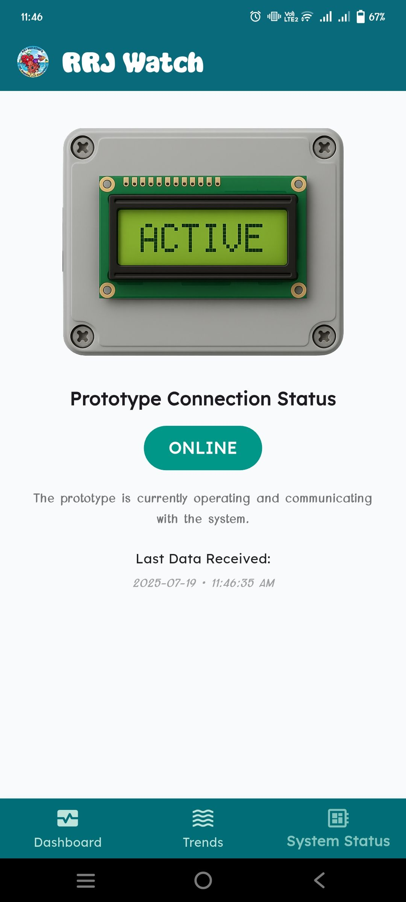

🐟 RRJ Watch: Smart Aquarium Monitoring & Automation App

A smart Flutter-based mobile application for real-time monitoring and automation of fish aquariums. The app allows remote monitoring of water quality, automated feeding control, and pH balancing. All integrated with Firebase for real-time data updates and scheduling.

---
📱 Features
```plaintext
- Real-Time Water Quality Monitoring
  - Displays live temperature, turbidity, and pH readings from Firestore
  - Automatically updates without refreshing the app

- Feeding Control System
  - Adjustable feeding schedules

- pH Balancing Control
  - Dispenses solution to maintain optimal pH levels when thresholds are exceeded

-  Hourly Analytics Visualization 
  - Displays a live graph of water quality trends per hour
  - Helps users track fluctuations over time

-  Smart Water Quality Status
  - Color-coded status: Good, Warning, or Critical
  - Based on thresholds defined for each parameter
```
---
```plaintext
🧰 Tech Stack

- Flutter (Dart)
- Firebase Firestore (Cloud NoSQL database)
- Firebase Core
- Provider (State management)
- Google Fonts, Flutter Vector Icons
- Material Design UI
```
---

Installation
```plaintext
Prerequisites

- Flutter SDK (`>=3.8.0`)
- Firebase project with Firestore enabled
- `google-services.json` (Android) in `android/app/`

Setup Instructions
1. Clone the Repository

   ```bash
   git clone https://github.com/yourusername/rrj-aquatique.git
   cd rrj-aquatique
2. Install Dependencies
    flutter pub get
   
3. Add Firebase Configuration
     Place your google-services.json file in: android/app/google-services.json

4. Run the App
```
---
📱 App Screenshots

|  |  |  |
|---------------------------------------------|---------------------------------------------|---------------------------------------------|
|  |  |  |
|  |  |  |

---

👥 Developers
De Arroz, Anghelo 
Alano, Renze 
Berana, Dyalah
Magbuhat, Kim Jomel
